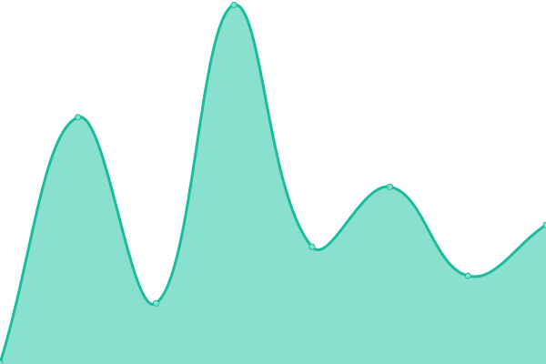
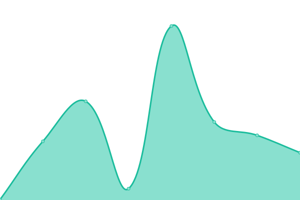
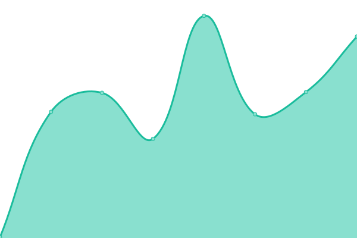

# [📈 Live Status](https://beaverbuilder.github.io/uptimes/): <!--live status--> **🟩 All systems operational**

This repository contains the open-source uptime monitor and status page for [Upptime](https://upptime.js.org), powered by [Upptime](https://github.com/upptime/upptime).

With [Upptime](https://upptime.js.org), you can get your own unlimited and free uptime monitor and status page, powered entirely by a GitHub repository. We use [Issues](https://github.com/upptime/upptime/issues) as incident reports, [Actions](https://github.com/beaverbuilder/uptimes/actions) as uptime monitors, and [Pages](https://upptime.github.io/upptime) for the status page.

<!--start: status pages-->
<!-- This summary is generated by Upptime (https://github.com/upptime/upptime) -->
<!-- Do not edit this manually, your changes will be overwritten -->
<!-- prettier-ignore -->
| URL | Status | History | Response Time | Uptime |
| --- | ------ | ------- | ------------- | ------ |
|  [Beaver Builder](https://www.wpbeaverbuilder.com/) | 🟩 Up | [beaver-builder.yml](https://github.com/beaverbuilder/uptimes/commits/HEAD/history/beaver-builder.yml) | 

 143ms
     
 | 

<a href="https://status.wpbeaverbuilder.com/history/beaver-builder">100.00%</a>
    

|  [Assistant](https://assistant.pro) | 🟩 Up | [assistant.yml](https://github.com/beaverbuilder/uptimes/commits/HEAD/history/assistant.yml) | 

 233ms
     
 | 

<a href="https://status.wpbeaverbuilder.com/history/assistant">100.00%</a>
    

|  [Assistant API](https://api.assistant.pro/api/status) | 🟩 Up | [assistant-api.yml](https://github.com/beaverbuilder/uptimes/commits/HEAD/history/assistant-api.yml) | 

 188ms
     
 | 

<a href="https://status.wpbeaverbuilder.com/history/assistant-api">100.00%</a>
    

|  [Forums](https://community.wpbeaverbuilder.com/) | 🟩 Up | [forums.yml](https://github.com/beaverbuilder/uptimes/commits/HEAD/history/forums.yml) | 

 239ms
     
 | 

<a href="https://status.wpbeaverbuilder.com/history/forums">100.00%</a>
    

|  [Docs](https://docs.wpbeaverbuilder.com/) | 🟩 Up | [docs.yml](https://github.com/beaverbuilder/uptimes/commits/HEAD/history/docs.yml) | 

 113ms
     
 | 

<a href="https://status.wpbeaverbuilder.com/history/docs">100.00%</a>
    

|  [Demo](https://demo.wpbeaverbuilder.com/) | 🟩 Up | [demo.yml](https://github.com/beaverbuilder/uptimes/commits/HEAD/history/demo.yml) | 

 165ms
     
 | 

<a href="https://status.wpbeaverbuilder.com/history/demo">100.00%</a>
    

|  [Hooks](https://hooks.wpbeaverbuilder.com/) | 🟩 Up | [hooks.yml](https://github.com/beaverbuilder/uptimes/commits/HEAD/history/hooks.yml) | 

 1906ms
     
 | 

<a href="https://status.wpbeaverbuilder.com/history/hooks">100.00%</a>
    

|  [Translate](https://translate.wpbeaverbuilder.com/) | 🟩 Up | [translate.yml](https://github.com/beaverbuilder/uptimes/commits/HEAD/history/translate.yml) | 

 488ms
     
 | 

<a href="https://status.wpbeaverbuilder.com/history/translate">100.00%</a>
    

<!--end: status pages-->

[**Visit our status website →**](https://beaverbuilder.github.io/uptimes/)

## 📄 License

- Powered by: [Upptime](https://github.com/upptime/upptime)
- Code: [MIT](./LICENSE) © [Upptime](https://upptime.js.org)
- Data in the `./history` directory: [Open Database License](https://opendatacommons.org/licenses/odbl/1-0/)
